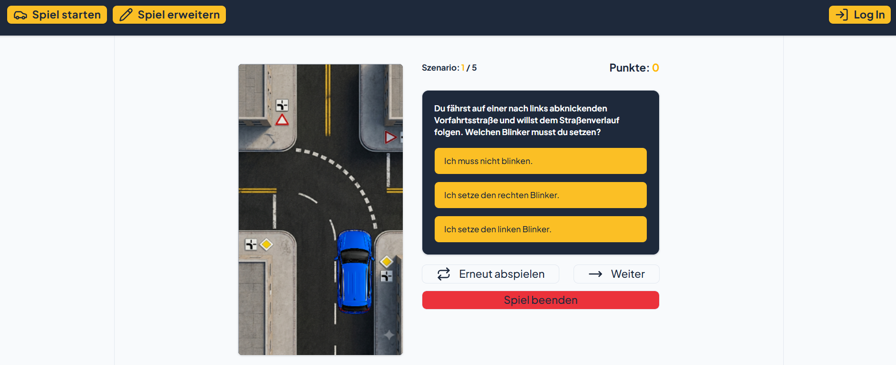

# Fahrschul-App

Eine Webapplikation zur interaktiven Simulation unterschiedlicher Verkehrssituationen mit dem Ziel, Kenntnisse der Straßenverkehrsordnung (StVO) spielerisch zu vermitteln. Authentifizierte Nutzer können ein Quiz spielen und sich dank der Canvas-Animation leicht in die Verkehrssituation hineinversetzen. Daneben ist es möglich, neue neue Verkehrsszenarien anzulegen. Die Authentifizierung erfolgt über Supabase (Social Login und Row Level Security). Für das Hochladen und Verwalten von Bilddateien wird der integrierte Objektspeicher genutzt. Die gesamte Anwendung habe ich selbst konzipiert - von der Anforderungsanalyse über das Datenmodell bis zur Implementierung.

## Voraussetzungen
Für die lokale Ausführung und das Kompilieren des Projekts werden folgende Komponenten benötigt:
* Node.js (aktuelle LTS-Version)
* Ein moderner Webbrowser
* Git (optional, falls Sie das Repository klonen möchten)
* Ein GitHub-Konto zur Authentifizierung

## Technologien
* **HTML5 & Canvas API:** Semantische Strukturierung der Benutzeroberfläche und hardwarebeschleunigtes 2D-Rendering für Fahrzeug-Animationen im virtuellen Raum.
* **TypeScript:** Typensichere Anwendungsarchitektur zur Modellierung der Quiz-Strukturen und automatisierter Schnittstellen-Typisierung via Supabase-CLI-Inferenz.
* **React:** Komponentenbasiertes UI-Rendering, Single-Page-Routing via React Router, globale Kontextverteilung, Callback-Caching und präzises Handling asynchroner Lebenszyklen.
* **Tailwind CSS (v4):** Modernste Frontend-Styling-Generation unter Nutzung der `@theme inline`-Direktive sowie des nativen `oklch()`-Farbraums für konsistente Farbdarstellungen und reaktive Dark-Mode-Klassen.
* **Shadcn/ui & Radix UI:** Wiederverwendbare, barrierefreie UI-Primitives (`Dialog`, `Table`, `Select`, `Popover`, `Calendar`, `Card`, `Textarea`, `Input`, `Label`, `Separator`) zur Gestaltung der Steuerelemente.
* **Lucide React:** Paketierung moderner, konsistenter SVG-Vektorsymbole zur visuellen Benutzeroberflächen-Unterstützung.
* **Date-fns:** Spezialisiertes Paket zur Formatierung von Zeitstempeln innerhalb der Datenverwaltung.
* **Supabase:** Cloudbasierte Backend-Infrastruktur zur Echtzeit-Verwaltung von PostgreSQL, OAuth-Authentifizierungsdiensten und Bucket-Speichern.
* **Vite:** Front-End-Build-Tool für eine performante Entwicklungsumgebung und optimierte Produktions-Builds.

## Technische Funktionsweise

Die Anwendung basiert auf einer datenbankintegrierten Client-Side-Architektur und implementiert folgende fortgeschrittene Kernkomponenten:

### Datenkonzeption und Typgenerierung (`database.types.ts` & `ScenarioTypes.ts`)
Die Datenintegrität ist direkt mit dem relationalen PostgreSQL-Schema verknüpft:
* **Relationales Schema:** Das System verwaltet zwei Haupttabellen. Die Tabelle `scenarios` speichert die mathematischen Koordinaten zur Vektorberechnung oder Animation der Verkehrssituationen (`startpointX`, `startpointY`, `endpointX`, `endpointY` jeweils als `number`) sowie Fragen, Antworten und den Speicherpfad der Bilddatei. Die Tabelle `scores` ist über einen Fremdschlüssel (`scores_scenarioId_fkey`) in einer explizit deklarierten 1:n-Beziehung mit den Szenarien verknüpft, um Spielergebnisse zu loggen.
* **Kompaktes Daten-Mapping:** Über das importierte Basis-Interface `Database` koppelt sich das Frontend direkt an die relationale Struktur. Dies garantiert, dass Änderungen am Backend-Schema sofort vom TypeScript-Compiler live validiert werden.

### Asynchrone API-Pipeline und transaktionales Asset-Management (`api.ts`)
Die Anwendung kommuniziert asynchron mit der PostgREST-Schnittstelle von Supabase und implementiert maßgeschneiderte Logiken:
* **Spielfluss-Steuerungsalgorithmus:** Die Funktion `pickFiveRandomIds` zieht über ein flaches Klonen des ID-Arrays (`[...allIds]`) und die gezielte Nutzung von `.splice(randomIndex, 1)` pro Spielrunde 5 einzigartige IDs aus dem Gesamtpool, wodurch Duplikate innerhalb einer Session ausgeschlossen werden.
* **Transaktionaler Speicher-Cleanup:** Vor dem Schreiben einer neuen Bilddatei prüft die Upload-Logik das Vorhandensein eines alten Bildpfads und entfernt die alte Bilddatei automatisiert aus dem Supabase-Storage-Bucket (`backgrounds`), um Speicherplatz einzusparen.
* **Kryptografisch geschützte Mediendistribution:** Zur Absicherung von Assets generiert die Funktion `getSignedUrl` über die Storage-API zeitlich begrenzte, kryptografisch signierte Zugriffspfade (`createSignedUrl`), die temporär an die UI-Elemente übergeben werden.
* **Kaskadierende Löschroutine:** Der Löschvorgang ermittelt über eine `.single()`-Abfrage zuerst die verknüpte Bild-URL, bereinigt das physische Asset vollständig aus dem Bucket und löscht erst nach erfolgreicher Speicher-Rückmeldung die Zeile aus der PostgreSQL-Relation.

### Sitzungs-Überwachung und OAuth-Authentifizierungs-Guard (`App.tsx` & `AuthProvider.tsx`)
* **Echtzeit-Session-Überwachung:** Im `AuthProvider` wird der initiale Abruf der Sitzungsdaten via `supabase.auth.getSession()` mit einem reaktiven Status-Listener `supabase.auth.onAuthStateChange()` gekoppelt. Dieser überwacht Logins, Token-Aktualisierungen sowie Logouts in Echtzeit und bereinigt beim Unmounten der Komponente alle Abonnements (`subscription.unsubscribe()`).
* **Dynamische OAuth-Umlenkung:** Die Funktion `signInWithGitHub` baut über `window.location.origin` die Redirect-URL zur Laufzeit so auf, dass der Benutzer nach erfolgreicher Drittanbieter-Authentifizierung fehlerfrei auf den GitHub-Pages-Pfad (`/fahrschulapp/`) zurückgeleitet wird.
* **Zentraler Authentifizierungs-Guard:** Die Komponente `ProtectedRoute` prüft den globalen Benutzerstatus. Existiert keine aktive Session, fängt sie das standardmäßige Routen-Rendering ab und zeigt stattdessen eine strukturierte Anmeldeaufforderung an. Geschützte Routen wie das Absolvieren des Quiz (`play`) und die Szenarien-Erfassung (`edit`) werden reaktiv gesichert.

### Interaktives Quiz-System und flackerfreies State-Management (`Play.tsx` & `Question.tsx`)
* **Sitzungs-Scoping:** Bei Spielstart generiert die Anwendung über die kryptografisch sichere System-API `crypto.randomUUID()` eine global eindeutige, unveränderliche Sitzungs-ID (`gameId`).
* **Zufallsshuffle und Normalisierung:** Die Komponente `Question` mischt die Auswahloptionen bei jedem Szenariowechsel über den Fisher-Yates-Algorithmus unvorhersehbar durch. Eine String-Normalisierung (`.trim().toLowerCase()`) eliminiert Formatierungsfehler beim Antwortabgleich. Punkte werden nur vergeben, wenn die korrekte Antwort direkt im ersten Versuch (`clickCount === 1`) gewählt wurde.
* **Transaktionales Score-Logging:** Das Absenden einer Antwort schreibt das Runden-Ergebnis (Punkte-Wert `1` oder `0`) typsicher unter Koppelung an die aktuelle `gameId`, `scenarioId` und die authentifizierte `userId` live in die relationale PostgreSQL-Datenbank. Nach Beenden der fünften Runde leitet das System den Benutzer um und bereinigt erst *danach* alle Zustandskanäle, um ein unschönes Aufflackern des Auswahl-Dialogs zu unterbinden.

### Hardwarebeschleunigtes 2D-Animationssystem (`Canvas.tsx`)
Die grafische Ausspielung der Verkehrssituationen erfolgt über eine performante HTML5-Canvas-Kopplung:
* **Callback-Optimierung:** Über ein dediziertes `useRef`-Pattern wird die Event-Übergabe der Eltern-Zustände entkoppelt, um unnötige Re-Renders der Zeichenfläche bei logischen Zustandskonflikten zu blockieren.
* **Synchronisiertes Image-Preloading:** Über JavaScript-`Promise`-Ketten werden die Bildressourcen des Fahrzeugmodells und der signierten Datenbank-Hintergrund-URL parallel vorab im Cache des Browsers geladen. Erst nach vollständiger Freigabe startet die Animationsschleife.
* **Matrix-Transformation und Rendering-Schleife:** Die Bewegung und zentrierte Fahrzeug-Rotation erfolgt über mathematische 2D-Vektoroperationen (`ctx.translate`, `ctx.rotate`). Die kontinuierliche Bewegung wird über `requestAnimationFrame` getaktet und verfügt über einen automatisierten Cleanup-Mechanismus (`cancelAnimationFrame`), um Speicherlecks (*Memory Leaks*) effektiv zu verhindern.

### Administrations-Oberfläche und defensive Datenbereinigung (`Edit.tsx`, `PreviewDialog.tsx` & `ScenarioDialog.tsx`)
* **Modulübergreifendes CRUD-Handling:** Die Komponente steuert das Neuanlegen sowie das zustandsbasierte Vorbelegen bestehender Datensätze im Bearbeitungsmodus über ein modales Overlay (`ScenarioDialog`). Nach dem Speichern wird automatisch ein stummer Refetch angestoßen, um die UI ohne Seiten-Reload zu aktualisieren. Erweitert wird dies über die Funktionen `addAnswerField` und `removeAnswerField`, die das reaktive Ergänzen oder Löschen von Antwortzeilen im Array vollkommen seiteneffektfrei (*immutable*) managen.
* **Entkopplung von Datei-Uploads:** Über eine `useRef`-Referenz auf den Datei-Input wird das ausgewählte Bild-Asset erst präzise beim Absenden des Formulars ausgelesen. Dies unterbindet unruhige Re-Render-Zyklen des Dialogs während der Dateiauswahl im System-Explorer.
* **Qualitätskontrolle via Preview-Dialog:** Der `PreviewDialog` stellt eine Vorschau der Animation im Quiz dar. Beim Schließen des Overlays sorgt ein Lifecycle-Guard für das Zurücksetzen des Zustands.
* **Layout-Schutz via Text-Kürzung:** Um zu verhindern, dass überlange Fragen das tabellarische Layout zerstören, sorgt die Kombination aus maximalen Breitenbeschränkungen (`max-w-30`) und der Klasse `truncate` für ein sauberes Kürzen der Zeichenketten. Das native HTML-Attribut `title` stellt parallel sicher, dass der vollständige Text beim Hovern als Tooltip lesbar bleibt.

## Layout und Design

Das visuelle Erscheinungsbild wird durch das modernisierte Tailwind-Framework und ein modulares Design-System bestimmt:
OKLCH-Farbraum & Dark Mode: Die App steuert ihr visuelles Erscheinungsbild über CSS Custom Properties im wahrnehmungskonsistenten oklch()-Farbraum. Über eine @custom-variant dark und die Spiegelung sämtlicher Werte innerhalb der Klasse .dark besitzt das Projekt ein tief integriertes Dark-Mode-System. Das Layout zentriert die Anwendung auf eine feste Inhaltsbreite von 1126px mit seitlichen Begrenzungsrahmen.
***
